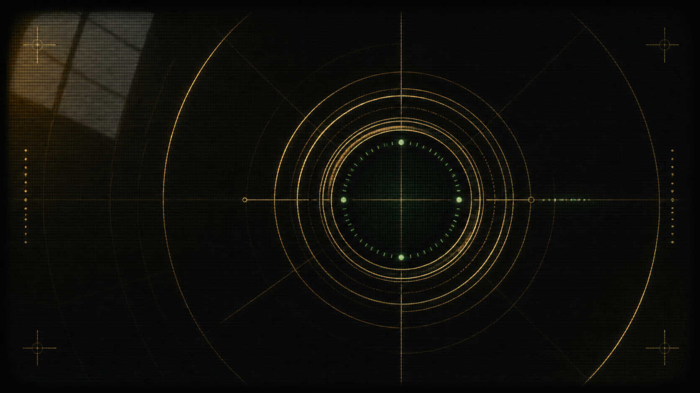

<p align="center">
  
</p>

<h1 align="center">DesktopGoldenEye</h1>

<p align="center">
  <strong>Bring your own ROM. Pick your settings. Play GoldenEye on Windows with modern mouse and WASD controls.</strong>
</p>

<p align="center">
  <a href="https://github.com/martin2844/DesktopGoldenEye/releases/latest"></a>
  
  
  <a href="LICENSE"></a>
</p>

DesktopGoldenEye is an unofficial, quality-first desktop package built on
[Graslu's 1964 GEPD Edition](https://github.com/Graslu/1964GEPD). It combines a
checksum-pinned upstream 1964GEPD core, GLideN64, Mouse Injector, AziAudio, a
focused launcher, and tested defaults into one portable download. It never
contains or downloads GoldenEye 007.

> [!IMPORTANT]
> v0.1 is an unsigned Windows prerelease. Windows may show a SmartScreen warning.
> The supported game is an unmodified US GoldenEye 007 ROM in z64, v64, or n64
> byte order. You provide that file yourself.

## Download and play

1. Download `DesktopGoldenEye-Windows-x86-0.1.0.0-Portable.exe` from the
   [latest release](https://github.com/martin2844/DesktopGoldenEye/releases/latest).
2. Open it. The portable package expands into
   `%LOCALAPPDATA%\DesktopGoldenEye\Portable` and keeps saves/settings there.
3. Select your legally obtained US GoldenEye 007 ROM.
4. Choose display and quality options, then press **Play GoldenEye**.

Prefer a transparent archive? Download the matching ZIP, extract the complete
folder, and run `DesktopGoldenEye.cmd`.

## What v0.1 includes

- Modern FPS input: WASD movement, direct mouse aim, click to fire, right-click
  to aim/zoom, wheel to change weapons, and predictable cursor capture.
- Fullscreen, borderless, and windowed display modes with configurable
  resolution, VSync, antialiasing, anisotropic filtering, aspect ratio, and FOV.
- A high-quality GLideN64 profile, GoldenEye timing fixes, optional unmodified
  enhanced HUD textures, and a stable 60 FPS-oriented baseline.
- ROM validation performed locally; the ROM is launched from its existing path
  and is never copied into the package.
- Automatic save backups, diagnostics, component hashes, source revision, and a
  file-level component inventory.
- A single self-extracting EXE plus a conventional portable ZIP.

## Default controls

| Action | Input |
|---|---|
| Move | `W` `A` `S` `D` |
| Aim | Mouse |
| Fire | Left mouse button |
| Aim / sniper zoom mode | Right mouse button |
| Zoom while aiming | `W` / `S` |
| Previous / next weapon | Mouse wheel |
| Reload | `R` |
| Use / cancel | `E` |
| Accept | `Q` |
| Crouch | `Ctrl` |
| Release / recapture mouse | `4` |
| Toggle fullscreen | `Alt+Enter` |

The launcher exposes Modern FPS, Hybrid, and Classic Injector profiles. The
windowed-mode capture fix keeps the pointer inside the game client so the
right-click desktop context menu does not interrupt sniper aiming.

## Mods

v0.1 establishes the runtime and packaging foundation; it does **not** yet ship
a public mod loader. ROM patches and 1964 cheats can be used manually today.
The planned first-class lane is a launcher-managed package format with clear
runtime compatibility, followed by a stable Lua API where the runtime permits
it. See [Modding Model](docs/MODDING_MODEL.md) and
[Roadmap](docs/ROADMAP.md).

## Build and verify

The release package is assembled on Windows 10/11 with PowerShell 5.1 or newer:

```powershell
.\scripts\package-desktopgoldeneye-windows.ps1 -Version 0.1.0.0
.\scripts\package-desktopgoldeneye-portable-exe.ps1 `
  -PackageArchive .\dist\DesktopGoldenEye-Windows-x86-0.1.0.0.zip
```

The packager downloads the official 1964GEPD no-Discord-RPC archive, pins it by
SHA-1 and SHA-256, and copies only the active release stack. Jabo and other
unused legacy plugins are not included in DesktopGoldenEye releases. Exact
plugin source is included as `1964\source.tar.xz` inside every package.

The repository also retains the forked 1964 source and a Visual Studio 2022
build project. That modern source build is experimental and is not the v0.1
player binary; the optimized VS2022 build still needs core-runtime work before
it can replace the release-qualified upstream executable.

See [Building on Windows](docs/BUILDING_WINDOWS.md) for the complete reproducible
process and [Desktop Release](docs/DESKTOP_RELEASE.md) for the release contract.

## Project map

| Path | Purpose |
|---|---|
| `launcher/windows/` | Player launcher, settings, ROM validation, saves, and diagnostics |
| `build/windows/` | Visual Studio 2022 project for the forked Win32 x86 core |
| `packaging/windows/` | Single-EXE bootstrap |
| `scripts/` | Build, package, and integrity-test automation |
| `docs/` | Architecture, quality baseline, mod plan, roadmap, and research notes |
| root C sources | GPL-2.0 1964/1964GEPD core and DesktopGoldenEye changes |

## Credits and licensing

DesktopGoldenEye exists because of the work of the original 1964 authors,
Graslu and the 1964GEPD contributors, Sergey Lipskiy and the GLideN64
contributors, the Mouse Injector contributors, Azimer and the AziAudio
contributors, Carnivorous, Flargy, and the wider GoldenEye modding community.

The active code stack is GPL-2.0. The optional GoldenEye HUD texture cache is
distributed unchanged under CC BY-NC-ND 3.0 with its original credits. See
[Third-party notices](THIRD_PARTY_NOTICES.md), [Notice](NOTICE.md), and
[License](LICENSE). This project is not affiliated with Nintendo, Rare,
Microsoft, MGM, EON Productions, or the upstream projects.
